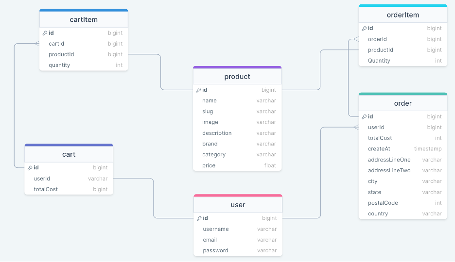

## notes 
- run: php artisan serve 

## database schema 

## citations 
1. Traversy Media, "Laravel 8 REST API With Sanctum Authentication", [link](https://www.youtube.com/watch?v=MT-GJQIY3EU)
2. Stack Overflow, "Call to a member function tokens() on null on Laravel Sanctum", [link](https://stackoverflow.com/questions/63351532/call-to-a-member-function-tokens-on-null-on-laravel-sanctum)
3. Code With Dary, "Eloquent One To One Relationship | Laravel For Beginners | Learn Laravel", [link](https://www.youtube.com/watch?v=sxGiIxf0Cgw)
4. Stack Overflow, "What does onDelete('cascade') mean?", [link](https://stackoverflow.com/questions/43094543/what-does-ondeletecascade-mean)
5. Yogesh Singh, "How to add Foreign key in Migration – Laravel", [link](https://makitweb.com/how-to-add-foreign-key-in-migration-laravel/)
6. The Codeholic, "Build and Deploy E-commerce Website with Laravel and Vue.js", [link](https://www.youtube.com/watch?v=jffKw_NMfnw) 
7. Stack Overflow, "Laravel migration default value", [link](https://stackoverflow.com/questions/37662955/laravel-migration-default-value) 
8. Stack Overflow, "Laravel Sanctum Auth issue", [link](https://stackoverflow.com/questions/62269976/laravel-sanctum-auth-issue)
9. "How does Laravel sanctum expire tokens?", [link](https://stackoverflow.com/questions/64117057/how-does-laravel-sanctum-expire-tokens)
10. Stack Overflow, "how to get property from api body in laravel?", [link](https://stackoverflow.com/questions/65221422/how-to-get-property-from-api-body-in-laravel)
11. The Codeholic, "Stripe Complete Checkout Process in Laravel", [link](https://www.youtube.com/watch?v=J13Xe939Bh8)
12. EnterpriseDB, "How to use PostgreSQL with Laravel" [link](https://www.enterprisedb.com/postgres-tutorials/how-use-postgresql-laravel)
13. JIMOH Mofoluwasho, "Hosting Your Laravel App on Heroku" [link](https://betterprogramming.pub/hosting-your-laravel-app-on-heroku-198764167a85)
14. "How to get request headers in Laravel", [link](https://hackthestuff.com/article/how-to-get-request-headers-in-laravel)
15. "Calling other function in the same controller?", [link](https://stackoverflow.com/questions/17861412/calling-other-function-in-the-same-controller)
16. Stack Overflow, "Laravel: add `stdout` stream for logging", [link](https://stackoverflow.com/questions/70126424/laravel-add-stdout-stream-for-logging)
17. Heroku Dev Center, "PHP Application Logging", [link](https://devcenter.heroku.com/articles/php-logging)
18. Stack Overflow, "Is it possible to pass custom data to stripe checkout?" [link](https://stackoverflow.com/questions/55742393/is-it-possible-to-pass-custom-data-to-stripe-checkout)
19. Geeks For Geeks, "How to convert array to string in PHP ?" [link](https://www.geeksforgeeks.org/how-to-convert-array-to-string-in-php/)
20. Stack Overflow, "Laravel - API return fields as string while they are int in the DB" [link](https://stackoverflow.com/questions/60966383/laravel-api-return-fields-as-string-while-they-are-int-in-the-db)